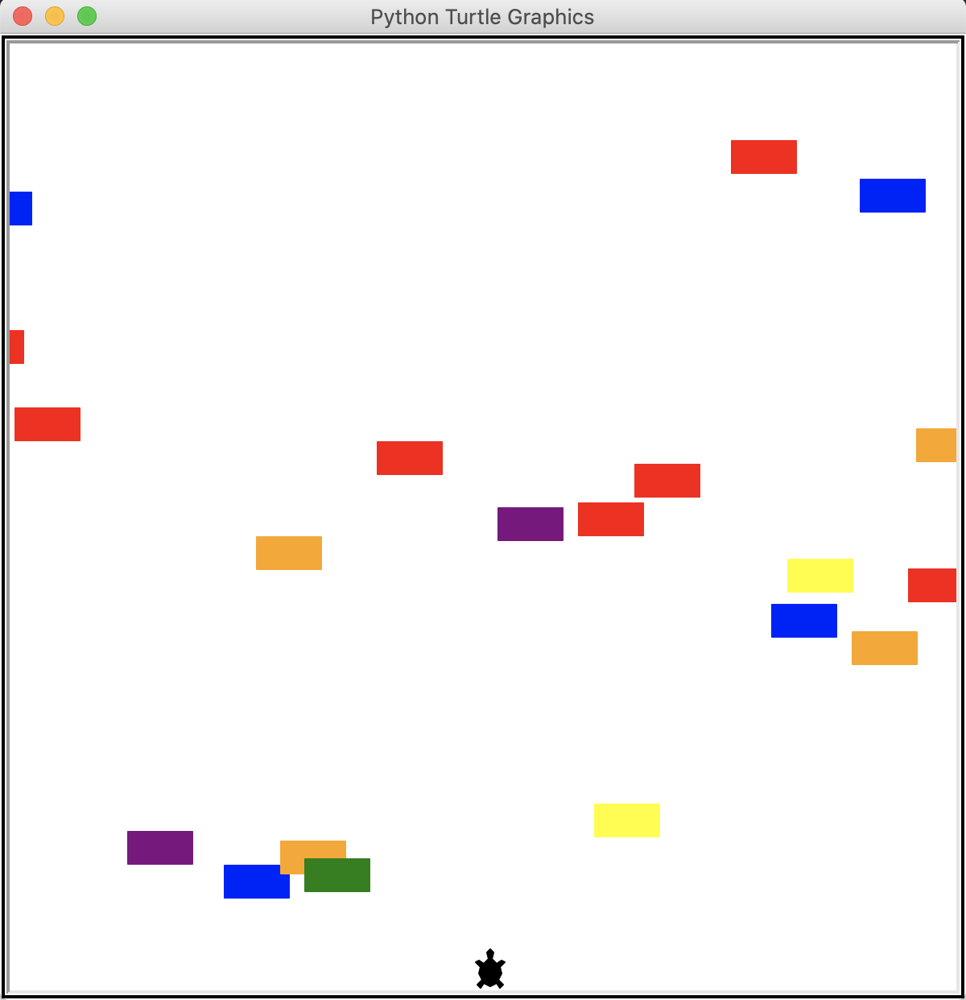
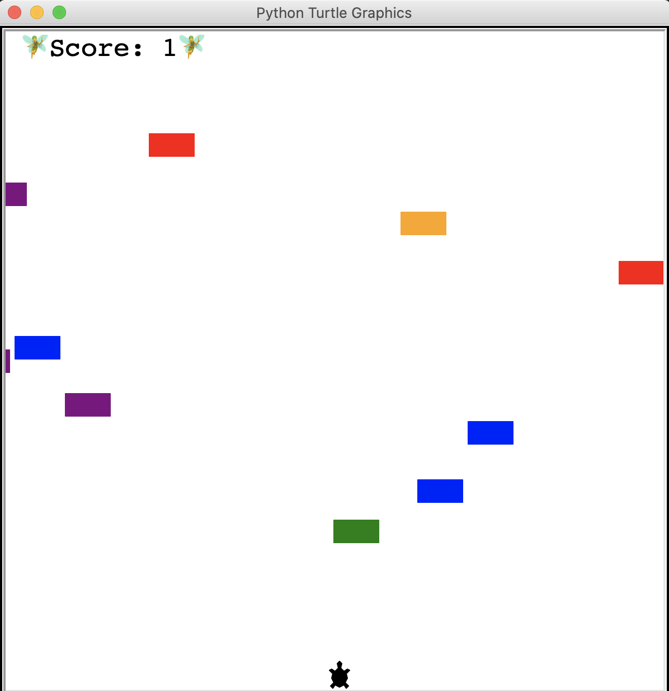

# crossing_street_game
Python "Crossing street" Game, using Turtle package

- Randomly generated cars 
- Score tracker
- Game Over display if turtle hit by a car
- Every time turtle cross successfully the screen, cars are going faster.

## Controls
⬆️ - Up Arrow

## Features that could be added:
- Save higher score within extern data file
- replay button or replay logic
- Generate random cars colors
- Make cars's shape rounder on the front 
- allow user to choose turtle color

